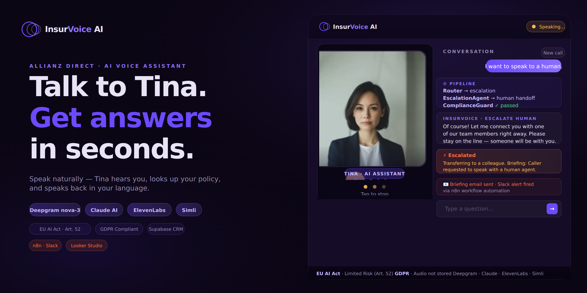

# InsurVoice AI



**AI voice agent for insurance customer service — meet Tina.**  
Ironhack AI Consulting Bootcamp · Final Project · Daria Bystrova

AI voice agent for insurance customer service built as an Ironhack AI Consulting Capstone Project. Speak naturally and Tina, a lip-synced avatar, hears you via live speech recognition (Deepgram), reasons through a multi-agent pipeline (Claude Sonnet), retrieves answers from an 87-FAQ knowledge base combined with pgvector semantic search over 5 real insurance policy PDFs, and speaks back (ElevenLabs). Every escalation automatically triggers an n8n workflow — Gmail briefing, Google Sheets log, and a Slack alert. EU AI Act Article 52 and GDPR compliant by design.

---

## Live Demo

🎭 **[Launch Avatar Interface](https://insurvoice-ai.onrender.com/avatar)** — Tina with lip-sync

*First load ~30s on free Render tier. Tina greets you automatically after 6 seconds.*

---

## Architecture


### Voice Pipeline

```
You speak / type
    ↓
Deepgram nova-2 ── live WebSocket STT, accent-robust
    ↓
InsurVoiceAgent (agent.py)
    ├── retrieve_context() ── dual RAG (see below)
    ├── Claude Sonnet ─────── grounded response generation
    ├── Intent classification → routing
    └── Escalation logic ──── auto-escalate after 2 low-confidence turns
    ↓
ElevenLabs TTS ──── text → MP3 audio (eleven_turbo_v2_5)
    ↓
Browser plays MP3 via audio.onended (mic reopens exactly when audio ends)
    ↓
PCM decoded from MP3 → sent to Simli for lip-sync only (Simli audio muted)
    ↓
Simli WebRTC ────── lip-synced avatar face (LiveKit transport, Frankfurt node)
```

### Dual RAG Pipeline

```
Every customer turn → retrieve_context(query)
    │
    ├── 1. Keyword search (knowledge.py)
    │       87 FAQs in knowledge_base.json
    │       Scores by word overlap → top 2 FAQs
    │       Fast (~5ms), always runs
    │
    └── 2. pgvector semantic search (rag.py)
            embed query → OpenAI text-embedding-3-large (1536 dims)
            cosine similarity → Supabase policy_chunks table
            top 3 chunks (similarity > 0.2)
            ~250ms, finds policy-specific detail

Both results combined → injected into Claude system prompt:
    === FAQ KNOWLEDGE BASE ===
    Q: Can I pay monthly? A: Yes, with 3-5% surcharge...

    === POLICY DOCUMENT CONTEXT ===
    [Source: Home Contents Insurance | Relevance: 91%]
    Water escaping from fixed pipes is covered as Leitungswasser...
```

### Automation Layer — n8n Workflow

Every call triggers the **Call Ended Webhook** to n8n, which routes data through the automation pipeline:

```
Flask Backend (agent.py)
    ├── Call ends
    ├── fire_n8n_webhook() fires in background thread
    └── POST to n8n with escalation data
                ↓
n8n Webhook Trigger: "Call Ended Webhook"
    ├── Responds immediately (200 OK back to Flask)
    ├── Logs to Google Sheets (ALL calls)
    ├── Sends Customer Summary Email (ALL calls) → customer_email
    └── SWITCH: "Was Escalated?"
         ├─ TRUE branch:
         │   ├── Sends Agent Briefing Email → your-support-email@example.com
         │   ├── Posts Slack Alert → #insurvoice-alerts
         │   └── Google Sheets flags: escalated=TRUE
         └─ FALSE branch:
             └── (inactive for non-escalations)
```

#### N8N Webhook Data Structure

The Flask backend sends this payload to n8n:

```json
{
  "call_id": "7af060b2-284e-43a5-bbf1-8eee92a5c0a6",
  "timestamp": "2026-06-17 14:12",
  "intent": "escalate_human",
  "route": "escalation",
  "language": "en",
  "turn_count": 4,
  "resolved": false,
  "escalated": true,
  "handoff_summary": "**Handoff Summary:** The customer is calling to file an insurance claim...",
  "compliance_passed": true,
  "urgency": "low",
  "summary": "Customer contacted InsurVoice AI regarding escalate_human...",
  "duration_seconds": 0,
  "customer_name": "Unknown",
  "customer_email": ""
}
```

**Key fields:**
- `escalated: true/false` — triggers SWITCH branching
- `handoff_summary` — sent to agent briefing
- `customer_email` — recipient for customer summary
- `urgency` — low/medium/high priority badge
- `compliance_passed` — GDPR/EU AI Act compliance flag

#### N8N Workflow Configuration

**Webhook Node Settings:**
- URL: `https://daria-b.n8n.irn.hk/webhook/insurvoice-call`
- Method: POST
- Response: Respond OK (200) immediately

**SWITCH Node Logic:**
```
Condition: {{ $json.body.escalated }} is equal to true
├─ TRUE branch → Email Agent Briefing + Slack Alert
└─ FALSE branch → (inactive)
```

**Key Fix:** All field references use `.body.` prefix because n8n receives the webhook wrapped in HTTP headers structure:
```
{{ $json.body.call_id }}
{{ $json.body.customer_name }}
{{ $json.body.intent }}
{{ $json.body.urgency }}
{{ $json.body.handoff_summary }}
{{ $json.body.timestamp }}
```

---

## Automation Outputs

### 1. **Agent Briefing Email** ✅

Sent to support team on escalation:

```
📧 To: your-support-email@example.com
Subject: Escalation Required — Call ID {call_id}

⚡ Escalation Required
InsurVoice AI • Human handoff

Agent Briefing:
├─ Customer: Unknown
├─ Email: (blank if not provided)
├─ Topic: escalate_human
├─ Language: en
├─ Turns: 4
├─ Priority: 🟢 LOW
│
├─ Handoff Summary:
│  "The customer is calling to file an insurance claim 
│   and has confirmed they have all the necessary 
│   details ready to proceed..."
│
├─ Conversation Summary:
│  "Customer contacted InsurVoice AI regarding escalate_human.
│   The conversation lasted 8 exchanges..."
│
└─ Call ID: 041175c9-7622-4d28-bb19-927df1491621
   Timestamp: 2026-06-17 10:50
   Compliance: ✓ Passed
```

**Template:** HTML with orange gradient header, professional table layout, compliance notice

### 2. **Customer Summary Email** ✅

Sent to customer for ALL calls (escalated or not):

```
📧 To: {customer_email} (or agent if blank)
Subject: Your Support Summary — Call ID {call_id}

✓ Your Support Request
InsurVoice AI • Call Summary

Thank you for contacting Allianz Direct. Here's a summary 
of your interaction:

Call Summary:
"Customer contacted InsurVoice AI regarding escalate_human.
 The conversation lasted 8 exchanges. The matter was not 
 fully resolved and requires follow-up."

Call Details:
├─ Call ID: 041175c9-7622-4d28-bb19-927df1491621
├─ Date & Time: 2026-06-17 10:04
├─ Topic: escalate_human
├─ Language: en
└─ Resolution: Pending - Agent follow-up required

Data Protection: This call was processed in compliance 
with GDPR and data protection regulations.

Next Steps: A human agent will contact you shortly 
to complete your request.
```

**Template:** HTML with blue gradient header, call details table, GDPR compliance notice, dynamic next steps

### 3. **Slack Alert** ✅

Posted to `#insurvoice-alerts` on escalation:

```
🚨 ESCALATION ALERT

Call ID: `041175c9-7622-4d28-bb19-927df1491621`
Customer: Unknown
Topic: escalate_human
Language: en
Turns: 4
Priority: 🟡 MEDIUM

Brief:
**Handoff Summary:**
The customer is calling to file an insurance claim 
and has confirmed they have all the necessary details ready 
to proceed. They have requested to speak with a human agent 
instead of continuing with the AI assistant.

Full briefing sent to email • Duration: 0s
Automated with this n8n workflow
```

**Format:** Rich text with emoji alerts, inline code for Call ID, priority badge, handoff summary

### 4. **Google Sheets Log** ✅

ALL calls logged to Google Sheet: `invoce-ai-data-log`

| Timestamp | Call ID | Customer Name | Customer Email | Language | Intent | Route | Escalated | Resolved | Turns | Duration (s) | Compliance | Summary |
|---|---|---|---|---|---|---|---|---|---|---|---|---|
| 2026-06-17 09:23 | 1e17d2e8-4220-bc30... | Unknown | (blank) | en | billing_query | billing | TRUE | FALSE | 2 | 0 | TRUE | Customer contacted InsurVoice... |
| 2026-06-17 08:40 | 9cc7b449-2178-4f0c... | Unknown | (blank) | en | escalate_human escalation | TRUE | FALSE | 4 | 0 | TRUE | Customer contacted InsurVoice... |

**Captures:** Timestamp, call_id, customer details, language, intent routing, escalation flag, resolution status, turn count, duration, compliance check, full conversation summary

---

## n8n Workflow

The automation workflow below handles every completed call. It immediately acknowledges the webhook, logs all conversations to Google Sheets, sends a customer summary email, and conditionally routes escalated calls to Slack and an agent briefing email.


## N8N Workflow Diagram

```
┌──────────────────────┐
│ Call Ended Webhook   │ (receives POST from Flask)
│ (POST)               │
└──────────────────────┘
           │
           ├─────────────┐
           │             │
    (responds OK)   │
           │        │
    ┌──────────────────────┐
    │ Respond OK           │ (200 OK back to Flask immediately)
    └──────────────────────┘
           │
           ├─ ALL CALLS ────────────────────────┐
           │                                    │
    ┌─────────────────────────┐      ┌──────────────────────┐
    │ Log to Google Sheets    │      │ Email Customer       │
    │ (append: sheet)         │      │ Summary              │
    └─────────────────────────┘      └──────────────────────┘
           │
    ┌──────────────────────┐
    │ Was Escalated?       │ (SWITCH: $json.body.escalated == true)
    └──────────────────────┘
           │
      ┌────┴────┐
      │          │
    TRUE      FALSE
      │          │
      ├─ ON ESCALATION ─────────────────┐
      │                                 │
   ┌──────────────────────┐    (inactive)
   │ Email Agent Briefing │
   │ (send: message)      │
   └──────────────────────┘
      │
   ┌──────────────────────┐
   │ Send a message       │ (Slack)
   │ (post: message)      │
   │ to #insurvoice-alerts│
   └──────────────────────┘
```

---

## Setup: N8N Workflow

### Prerequisites
1. **N8N account** (self-hosted or n8n.cloud)
2. **Slack workspace** with bot permissions
3. **Gmail account** with app password
4. **Google Sheets** document with columns for logging

### Step 1: Create Webhook Trigger

1. Create new n8n workflow
2. Add **Webhook** node
3. Set:
   - **Method:** POST
   - **Path:** `/webhook/insurvoice-call`
   - **Authentication:** None (we'll validate in Flask)
4. **Respond immediately:** Yes (200 OK)

### Step 2: Add Google Sheets Node (ALL CALLS)

1. **Node:** Google Sheets (append row)
2. **Spreadsheet:** Select your logging sheet
3. **Sheet:** Select sheet tab
4. **Map columns:**
   - Timestamp: `{{ $json.body.timestamp }}`
   - Call ID: `{{ $json.body.call_id }}`
   - Customer Name: `{{ $json.body.customer_name }}`
   - Customer Email: `{{ $json.body.customer_email }}`
   - Language: `{{ $json.body.language }}`
   - Intent: `{{ $json.body.intent }}`
   - Route: `{{ $json.body.route }}`
   - Escalated: `{{ $json.body.escalated }}`
   - Resolved: `{{ $json.body.resolved }}`
   - Turns: `{{ $json.body.turn_count }}`
   - Duration (s): `{{ $json.body.duration_seconds }}`
   - Compliance: `{{ $json.body.compliance_passed }}`
   - Summary: `{{ $json.body.summary }}`

### Step 3: Add Email Customer Summary Node (ALL CALLS)

1. **Node:** Gmail (send email)
2. **To Email:** `{{ $json.body.customer_email }}`
3. **Subject:** `Your Support Summary — Call ID {{ $json.body.call_id }}`
4. **Email Type:** HTML
5. **Message Text:** [See Customer Summary template above]

### Step 4: Add SWITCH Node

1. **Node:** SWITCH
2. **Condition:** `{{ $json.body.escalated }}` is equal to `true`
3. **Connect TRUE branch** to next nodes (Agent Briefing + Slack)

### Step 5: Add Email Agent Briefing Node (ESCALATION ONLY)

1. **Connect to:** SWITCH TRUE branch
2. **Node:** Gmail (send email)
3. **To Email:** `your-support-email@example.com`
4. **Subject:** `Escalation Required — Call ID {{ $json.body.call_id }}`
5. **Email Type:** HTML
6. **Message Text:** [See Agent Briefing template above]

### Step 6: Add Slack Alert Node (ESCALATION ONLY)

1. **Connect to:** SWITCH TRUE branch
2. **Node:** Slack (send message)
3. **Channel:** `#insurvoice-alerts`
4. **Message Type:** Simple Text Message
5. **Message Text:**
```
🚨 *ESCALATION ALERT*

*Call ID:* `{{ $json.body.call_id }}`
*Customer:* {{ $json.body.customer_name }}
*Topic:* {{ $json.body.intent }}
*Language:* {{ $json.body.language }}
*Turns:* {{ $json.body.turn_count }}
*Priority:* {{ $json.body.urgency | capitalize }}

*Brief:*
{{ $json.body.handoff_summary }}

_Full briefing sent to email • Duration: {{ $json.body.duration_seconds }}s_
```

### Step 7: Test & Deploy

1. **Save workflow**
2. Trigger a test escalation in the app
3. Verify:
   - ✅ Row added to Google Sheets
   - ✅ Customer email received
   - ✅ Agent email received
   - ✅ Slack message posted

---

## Environment Variables (Render)

Add to Render dashboard → Environment:

```
N8N_WEBHOOK_URL=https://{your-n8n-instance}/webhook/insurvoice-call

GMAIL_EMAIL=your-gmail@example.com
GMAIL_PASSWORD=xxxx xxxx xxxx xxxx  (16-char app password, not account password)
```

**Note:** Create Gmail app password at: [myaccount.google.com/apppasswords](https://myaccount.google.com/apppasswords)

---

## Evaluation Results (June 2026)

Tested against 30 realistic customer questions using production `agent.py` with dual RAG active.

```
Model:   claude-sonnet-4-6
RAG:     pgvector (Supabase) + keyword fallback (knowledge_base.json)
Cases:   30
```

| Metric | Target | Result | Status |
|---|---|---|---|
| Routing accuracy | ≥ 85% | **86.7%** (26/30) | ✅ PASS |
| Keyword coverage | ≥ 70% | **85.6%** | ✅ PASS |
| Overall pass rate | — | **83.3%** | ✅ |
| Avg response time | < 8s | **4.3s** | ✅ |
| Compliance rate | 100% | **100%** | ✅ |

**Intent routing breakdown:**
- Claims (file_claim, claim_status): 4/5 correct
- Policy coverage: 9/10 correct
- Billing queries: 5/5 correct ✅
- General info: 5/5 correct ✅
- Escalation: 2/2 correct ✅

**What improved with dual RAG:**
- Billing keywords (grace period, surcharge, direct debit, portal): keyword search now always fires alongside pgvector
- Opening hours (Monday, Friday, Saturday): FAQ now found reliably
- Policy-specific terms (Leitungswasser, Elementarschäden, Tierhalterhaftpflicht): retrieved from actual PDF chunks

---

## Knowledge Base & RAG

### Two-layer retrieval — always both, not one-or-other

```python
# rag.py — retrieve_context()
def retrieve_context(query):
    # Layer 1: pgvector semantic search on 5 policy PDFs
    rag_results = semantic_search(query, n_results=3)

    # Layer 2: keyword search on 87 FAQs — always runs
    faq_context = keyword_retrieve(query, top_k=2)

    # Both combined and injected into Claude prompt
    return faq_context + rag_context
```

Previously: RAG-or-fallback (only keyword if pgvector failed)  
Now: RAG-AND-FAQ (both always, FAQs first for specificity)

### Knowledge base — 87 FAQs

`mvp/web/data/knowledge_base.json` — 87 FAQs across 6 categories:

| Category | FAQs | Key topics |
|---|---|---|
| home_insurance | 23 | Water/fire/theft/storm, Leitungswasser, electronics, vandalism |
| claims | 17 | Filing, timelines, rejection appeals, settlement, new-for-old |
| billing | 13 | Monthly/annual payment, grace period, surcharge, SEPA, discounts |
| policy | 13 | Renewal, cancellation, moving home, deductibles, cooling-off |
| general | 14 | Opening hours Mon-Fri 8-20 / Sat 9-17, portal, complaints, ombudsman |
| liability | 7 | Dog damage, child accidents, tenant liability, lawyer costs |

### Policy PDFs — 5 documents, 27 pgvector chunks

| Document | Chunks | Key content |
|---|---|---|
| Home Contents Insurance | 8 | Leitungswasser, fire, theft, sum insured, deductibles |
| Insurance Claims Guide | 5 | Filing process, timelines, documentation, settlement |
| Glass Breakage Insurance | 4 | Glasbruch extension, EUR 100 deductible |
| Extension to Home Contents Policy | 5 | Elementarschäden, flood, earthquake, natural hazards |
| Personal Liability Insurance | 5 | Haftpflicht, Tierhalterhaftpflicht, dog liability |

### Ingesting policy PDFs

```bash
cd mvp/web
python rag.py --ingest   # chunks, embeds, stores all PDFs → Supabase
python rag.py --test     # verify semantic search with 7 sample queries
```

Requires `OPENAI_API_KEY` and `DATABASE_URL` in `.env`. Run once — chunks persist in Supabase.

### Supabase schema

```sql
CREATE EXTENSION IF NOT EXISTS vector;

CREATE TABLE policy_chunks (
    id SERIAL PRIMARY KEY,
    document VARCHAR(255),
    chunk_index INTEGER,
    content TEXT,
    embedding vector(1536),
    created_at TIMESTAMPTZ DEFAULT NOW()
);

CREATE INDEX ON policy_chunks USING hnsw (embedding vector_cosine_ops);
```

---

## Audio Architecture

The avatar has two audio paths — only one plays sound:

```
Server → MP3 bytes → base64 → browser
    ├── new Audio('data:audio/mpeg;base64,...').play()    ← YOU HEAR THIS
    └── decode MP3 → PCM16 → simliClient.sendAudioData() ← lip-sync only
         (avatarAudio element permanently muted, volume=0, onplay=pause)
```

**Mic timing:** reopens via `audio.onended` — the exact moment MP3 finishes playing, not a timer. Previously used an estimated duration which caused the mic to stay closed too long, requiring 3-5 repetitions.

**Greeting delay:** 6 seconds after socket connect, giving Simli time to initialize before audio is sent.

---

## Deployment

### Render.com

| Setting | Value |
|---|---|
| Root Directory | `mvp/web` |
| Build Command | `pip install -r requirements.txt && python download_data.py` |
| Start Command | `gunicorn --worker-class sync --workers 1 --threads 100 --bind 0.0.0.0:$PORT --timeout 120 server:app` |

**Important:** Set the Start Command directly in the Render dashboard — it overrides `render.yaml`.

**render.yaml location:** `mvp/render.yaml` — Render reads this. `mvp/web/render.yaml` is ignored.

**Worker class history:** gevent (ssl recursion error) → eventlet (gunicorn 26 dropped entry point) → **sync + threads 100** (works perfectly).

### download_data.py fix

`download_data.py` runs at every build and previously overwrote `knowledge_base.json` with only 7 entries. Fixed to check if a larger KB already exists before overwriting:

```python
if out.exists():
    existing_count = len(json.loads(out.read_text())["faqs"])
    if existing_count > len(kb["faqs"]):
        log(f"Kept existing knowledge base: {existing_count} FAQ entries")
        return True
```

Build log should show: `→ Kept existing knowledge base: 87 FAQ entries`

---

## Required API Keys

Set all in Render dashboard → Environment:

| Key | Service | Notes |
|---|---|---|
| `ANTHROPIC_API_KEY` | Claude reasoning | `claude-sonnet-4-6` |
| `DEEPGRAM_API_KEY` | Live STT | nova-2 model |
| `ELEVENLABS_API_KEY` | Voice synthesis | ElevenAPI credits (pay-as-you-go, separate from subscription plan) |
| `ELEVENLABS_VOICE_ID` | Voice ID | From ElevenLabs dashboard |
| `SIMLI_API_KEY` | Avatar lip-sync | Hobby plan ($10/mo) after free 50 min |
| `SIMLI_FACE_ID` | Avatar face | From Simli dashboard |
| `OPENAI_API_KEY` | RAG embeddings | `text-embedding-3-large` for pgvector ingestion |
| `DATABASE_URL` | Supabase PostgreSQL | RAG chunks + CRM + call_log |
| `FLASK_SECRET` | Session security | Auto-generated by Render |
| `N8N_WEBHOOK_URL` | Automation | Webhook for escalation notifications |
| `GMAIL_EMAIL` | Gmail sender | your-gmail@example.com |
| `GMAIL_PASSWORD` | Gmail app password | 16-char app password (not account password) |

### ElevenLabs billing note

The ElevenLabs Starter plan ($6/mo) covers **ElevenAgents minutes** — not direct API calls. The `/v1/text-to-speech` endpoint draws from **ElevenAPI credits** (pay-as-you-go). Add $2–5 at **elevenlabs.io/app/subscription → ElevenAPI tab → Add credits** ($0.05 per 1K characters).

---

## Requirements

```
flask>=3.0
flask-socketio>=5.3
simple-websocket>=0.10
requests>=2.31
python-dotenv>=1.0
gunicorn>=21.2
anthropic>=0.25.0
websockets>=12.0
psycopg2-binary>=2.9
openai>=1.0
pdfplumber>=0.10
```

No eventlet or gevent — threading mode with gunicorn sync worker avoids ssl recursion errors on Render.

---

## Project Structure

```
insurvoice-ai/
├── README.md                    ← this file (only README)
├── banner.png
├── architecture.png
└── mvp/
    ├── render.yaml              ← Render reads THIS (not mvp/web/render.yaml)
    └── web/
        ├── server.py            ← Flask + SocketIO, all routes + socket events
        ├── agent.py             ← InsurVoiceAgent (Claude Sonnet, dual RAG, multi-turn)
        ├── rag.py               ← Dual retrieval: pgvector + keyword combined
        ├── knowledge.py         ← 87-FAQ keyword search
        ├── stream.py            ← DeepgramStreamSession (WebSocket STT)
        ├── voice.py             ← ElevenLabs MP3 synthesis
        ├── stt.py               ← Deepgram REST fallback
        ├── crm.py               ← Supabase CRM lookup
        ├── n8n_integration.py   ← Post-escalation webhook (threading, no gevent)
        ├── download_data.py     ← Build-time setup (preserves existing KB)
        ├── evaluate.py          ← 30-question accuracy evaluation
        ├── requirements.txt
        ├── data/
        │   ├── knowledge_base.json   ← 87 FAQs (keyword layer)
        │   └── policies/             ← 5 policy PDFs (pgvector layer)
        ├── static/
        │   ├── avatar.js
        │   └── simli-client.js       ← Simli WebRTC SDK
        └── templates/
            ├── index.html            ← Voice-only interface
            └── avatar.html           ← Tina avatar (muted Simli audio, onended mic)
```

---

## What's Working (June 2026)

| Feature | Status |
|---|---|
| Avatar loads + lip-syncs | ✅ |
| Greeting fires after 6s (Simli ready) | ✅ |
| Live mic transcription (Deepgram nova-2) | ✅ |
| Mic reopens via audio.onended (not timer) | ✅ |
| Single audio output (Simli audio permanently muted) | ✅ |
| Claude Sonnet response generation | ✅ |
| ElevenLabs voice synthesis (MP3) | ✅ |
| Dual RAG: pgvector + FAQ keyword | ✅ |
| Text input with session continuity (X-Socket-ID) | ✅ |
| Intent routing (claims/billing/policy/escalation) | ✅ |
| EU AI Act disclosure on first turn | ✅ |
| **n8n automation workflow** | **✅** |
| **Google Sheets logging** | **✅** |
| **Gmail notifications (Agent + Customer)** | **✅** |
| **Slack escalation alerts** | **✅** |
| knowledge_base.json preserved across deploys | ✅ |

---

## Demo Script

**Claims:**
> *"I want to file a claim for water damage"* → routes to claims, asks for policy number + photos

**RAG-grounded policy answer:**
> *"Does my policy cover burst pipes?"* → semantic search finds Leitungswasser clause from Home Contents PDF (91% match), EUR 250 deductible mentioned

**Billing (keyword FAQ):**
> *"Can I pay monthly?"* → FAQ retrieves: monthly available with 3-5% surcharge, switch at renewal

**Opening hours (keyword FAQ):**
> *"What are your opening hours?"* → Monday to Friday 8am to 8pm, Saturday 9am to 5pm

**Compliance:**
> *"Are you a real person?"* → identifies as AI (EU AI Act Art. 52)

**Escalation + n8n automation:**
> *"I want to speak to a human"* → transfers, fires n8n → Slack alert + Google Sheets log + Gmail briefing to agent + customer summary email

---

## Sample Conversation

```
🤖 Tina   Hello, you're speaking with InsurVoice, an AI assistant for Allianz Direct.
           How can I help you today?

👤 User    My pipe burst and flooded my flat.

🤖 Tina   I'm sorry to hear that — a burst pipe is really stressful. The good news
           is this is covered under your Hausratversicherung as Leitungswasser damage.
           Your EUR 250 deductible applies. To file a claim I'll need your policy
           number, the date it happened, and photos of the damage if possible.
           [RAG: Home Contents Insurance 91% + Claims Guide 74%]

👤 User    I want to speak to a human.

🤖 Tina   Of course, I'll connect you to a colleague right away. Please hold.

↗️ Escalated → n8n Automation:
   ├── 📊 Google Sheets: New row logged with call details
   ├── 📧 Agent Briefing: Email sent to support team
   ├── 📧 Customer Summary: Email sent to customer
   └── 💬 Slack Alert: Posted to #insurvoice-alerts
```

---

## Compliance

| Regulation | Implementation |
|---|---|
| EU AI Act Art. 52 | AI identity disclosed on every first turn; enforced in `agent.py` system prompt |
| GDPR | Audio streamed then discarded; not stored; no biometric profiling |
| Data minimisation | Only intent labels logged, not message content |

---

## Author

**Daria Bystrova** · Ironhack AI Consulting Bootcamp · 2026  
GitHub: [github.com/dbystrova26/insurvoice-ai](https://github.com/dbystrova26/insurvoice-ai)

*Fictional scenario for educational purposes. Not affiliated with Allianz, Anthropic, Deepgram, ElevenLabs, Simli, Supabase, or n8n.*