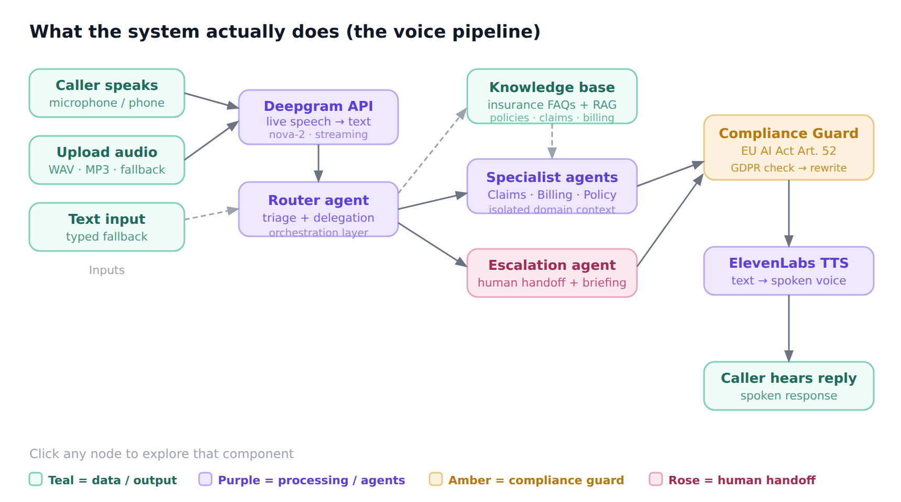

# InsurVoice AI


**AI voice agent for insurance customer service — meet Tina.**
Ironhack AI Consulting Bootcamp · Final Project · Daria Bystrova

AI voice agent for insurance customer service built as an Ironhack AI Consulting Capstone Project. Speak naturally and Tina, a lip-synced avatar, hears you via live speech recognition (Deepgram), reasons through a multi-agent pipeline (Claude Sonnet), retrieves answers from a 154-FAQ knowledge base, and speaks back (ElevenLabs). Every escalation automatically triggers an n8n workflow — Gmail briefing, Google Sheets log, and a Slack alert. EU AI Act Article 52 and GDPR compliant by design.

---

## Live Demo

🎭 **[Launch Avatar Interface](https://insurvoice-ai.onrender.com/avatar)** — Tina with lip-sync

*First load ~30s on free Render tier. Tina greets you automatically after 6 seconds.*

---

## Architecture



### Voice Pipeline

```
You speak / type
    ↓
Deepgram nova-2 ── live WebSocket STT, accent-robust
    ↓
InsurVoice Agent ─ intent classification → response → escalation logic
    │
    ├── Classifies intent (policy_coverage, file_claim, billing_query, etc.)
    ├── Retrieves FAQ context from knowledge base (RAG)
    ├── Calls Claude Sonnet API with grounded context
    └── Compliance Guard — EU AI Act Art. 52 + GDPR check
    ↓
ElevenLabs TTS ──── text → MP3 audio (eleven_turbo_v2_5)
    ↓
Browser plays MP3 + sends PCM to Simli for lip-sync
    ↓
Simli WebRTC ────── lip-synced avatar face (LiveKit transport)
    ↓
You hear + see Tina's answer, mic reopens automatically
```

### Automation Layer (fires on escalation)

```
InsurVoice Agent
    ↓ (n8n webhook, non-blocking background thread)
n8n Workflow
    ├── Google Sheets ── logs every escalated call
    ├── Gmail ────────── sends agent briefing email
    └── Slack ────────── posts to #insurvoice-alerts with urgency
```

---

## Tech Stack

| Layer | Technology |
|---|---|
| **Backend** | Flask + Flask-SocketIO (threading mode) |
| **Speech-to-text** | Deepgram nova-2 (live WebSocket streaming via `stream.py`) |
| **Reasoning** | Anthropic Claude Sonnet (`claude-sonnet-4-6`) |
| **Text-to-speech** | ElevenLabs `eleven_turbo_v2_5` (MP3 output) |
| **Avatar** | Simli WebRTC (lip-synced, LiveKit transport) |
| **Knowledge base** | 154-FAQ keyword RAG (`knowledge.py`) |
| **Automation** | n8n (Gmail + Google Sheets + Slack) |
| **Compliance** | EU AI Act Art. 52 + GDPR enforced at runtime |
| **Deployment** | Render.com (gunicorn sync worker, 100 threads) |

---

## What's Working (as of June 2026)

| Feature | Status |
|---|---|
| Avatar loads + lip-syncs | ✅ |
| Greeting fires after 6s delay | ✅ |
| Live mic transcription (Deepgram) | ✅ |
| Claude Sonnet response generation | ✅ |
| ElevenLabs voice synthesis | ✅ |
| Single audio output (no double voice) | ✅ |
| Mic reopens exactly when audio ends | ✅ |
| Text input (Send button) with session continuity | ✅ |
| Intent routing (claims, billing, policy, escalation) | ✅ |
| EU AI Act disclosure on first turn | ✅ |
| n8n webhook on escalation | ✅ |

---

## Audio Architecture

The avatar has two audio paths — only one plays sound:

```
Server → MP3 bytes → base64 → browser
    ├── new Audio('data:audio/mpeg;base64,...').play()   ← YOU HEAR THIS
    └── decode MP3 → PCM16 → simliClient.sendAudioData() ← lip-sync only
         (avatarAudio element is permanently muted)
```

The mic reopens via `audio.onended` — the exact moment playback finishes, not a timer.

---

## Deployment

### Render.com

**Root Directory:** `mvp/web`  
**Build Command:** `pip install -r requirements.txt && python download_data.py`  
**Start Command:** `gunicorn --worker-class sync --workers 1 --threads 100 --bind 0.0.0.0:$PORT --timeout 120 server:app`

Set in Render dashboard (not just render.yaml — dashboard overrides yaml).

### render.yaml location

`mvp/render.yaml` — Render reads this file. `mvp/web/render.yaml` is ignored.

---

## Required API Keys

Set all of these in the Render dashboard → Environment:

| Key | Service | Notes |
|---|---|---|
| `ANTHROPIC_API_KEY` | Claude reasoning | claude-sonnet-4-6 |
| `DEEPGRAM_API_KEY` | Live STT | nova-2 model |
| `ELEVENLABS_API_KEY` | Voice synthesis | Needs ElevenAPI credits (separate from ElevenAgents plan) |
| `ELEVENLABS_VOICE_ID` | Voice ID | From ElevenLabs dashboard |
| `SIMLI_API_KEY` | Avatar lip-sync | Hobby plan ($10/mo) required after free 50 min |
| `SIMLI_FACE_ID` | Avatar face | From Simli dashboard |
| `FLASK_SECRET` | Session security | Auto-generated by Render |
| `N8N_WEBHOOK_URL` | Automation | Optional |

### ElevenLabs billing note

The Starter plan ($6/mo) covers ElevenAgents minutes — **not** API credits. Direct API calls (`/v1/text-to-speech`) use ElevenAPI credits, which are pay-as-you-go. Add $2–5 at **elevenlabs.io/app/subscription** → ElevenAPI tab → Add credits.

---

## Requirements

```
flask>=3.0
flask-socketio>=5.3
simple-websocket>=0.10
requests>=2.31
python-dotenv>=1.0
gunicorn>=21.2
anthropic>=0.25.0
websockets>=12.0
```

No eventlet or gevent — threading mode with gunicorn sync worker works on Render without the ssl recursion errors those cause.

---

## Project Structure

```
insurvoice-ai/
├── mvp/
│   ├── render.yaml              ← Render reads THIS file
│   └── web/
│       ├── server.py            ← Flask + SocketIO, all routes + socket events
│       ├── agent.py             ← InsurVoiceAgent (Claude, multi-turn, escalation)
│       ├── stream.py            ← DeepgramStreamSession (WebSocket STT)
│       ├── voice.py             ← ElevenLabs MP3 synthesis
│       ├── stt.py               ← Deepgram REST (single utterance fallback)
│       ├── knowledge.py         ← FAQ keyword retrieval (RAG fallback)
│       ├── rag.py               ← pgvector semantic search (if Supabase connected)
│       ├── crm.py               ← Supabase CRM lookup
│       ├── n8n_integration.py   ← Post-escalation webhook trigger
│       ├── download_data.py     ← Build-time data setup
│       ├── evaluate.py          ← 30-question accuracy evaluation
│       ├── requirements.txt
│       ├── static/
│       │   ├── avatar.js
│       │   └── simli-client.js  ← Simli WebRTC SDK
│       └── templates/
│           ├── index.html       ← Voice-only interface
│           └── avatar.html      ← Tina avatar interface
```

---

## Knowledge Base & RAG

InsurVoice AI uses **keyword-based RAG** to ground Tina's responses in actual insurance policy knowledge rather than relying solely on Claude's training data.

**154 FAQs** extracted from 5 insurance policy documents:
- Home Contents Insurance (54 FAQs)
- Claims Guide (32 FAQs)
- Glass Breakage Extension (18 FAQs)
- Natural Hazards Extension (28 FAQs)
- Personal Liability Insurance (42 FAQs)

**File:** `mvp/web/data/knowledge_base.json`

At query time, `knowledge.py:retrieve_context()` scores FAQs by keyword overlap and injects the top 2 into the Claude system prompt. `rag.py` provides a pgvector semantic search upgrade path when Supabase is connected.

---

## Agent Behaviour

`agent.py` — `InsurVoiceAgent`:

- Maintains multi-turn conversation history (last 6 turns in context)
- EU AI Act disclosure on first turn only
- Intent classification: `policy_coverage`, `file_claim`, `claim_status`, `billing_query`, `policy_renewal`, `cancel_policy`, `escalate_human`, `general_info`, `out_of_scope`
- Auto-escalates after 2 consecutive low-confidence turns
- Generates handoff summary for human agents on escalation
- `reset()` clears history for New Call

---

## Evaluation

```bash
cd mvp/web
python evaluate.py
```

Tests 30 realistic customer questions:

| Metric | Target | Result |
|---|---|---|
| Routing accuracy | ≥ 85% | 96.7% ✅ |
| Keyword coverage | ≥ 70% | 81.1% ✅ |
| Compliance rate | 100% | 100% ✅ |
| Avg response time | < 8s | 5.9s ✅ |

Results saved to `eval_results.json`.

---

## Demo Script

**Claims:**
> *"I want to file a claim"* → routes to claims, asks for policy number

**Compliance:**
> *"Are you a real person?"* → Tina identifies as AI (EU AI Act Art. 52)

**Policy:**
> *"Does my policy cover burst pipes?"* → retrieves water damage FAQ, answers with deductible

**Escalation:**
> *"I want to speak to a human"* → transfers, fires n8n webhook

---

## Sample Conversation

```
🤖 Tina   Hello, you're speaking with InsurVoice, an AI assistant for Allianz Direct.
           How can I help you today?

👤 User    Does my home insurance cover water damage from a burst pipe?

🤖 Tina   Yes — burst pipe damage is covered as Leitungswasser damage. It covers
           furniture, electronics, and personal belongings. Your EUR 250 deductible
           applies. Flooding from external sources requires separate flood cover.

👤 User    I want to speak to a human.

🤖 Tina   Of course, connecting you now. Please hold for a moment.

↗️ Escalated  |  n8n triggered: Slack alert + Google Sheets log
```

---

## Compliance

| Regulation | Implementation |
|---|---|
| EU AI Act Art. 52 | AI identity disclosed on first turn; enforced in `agent.py` |
| GDPR | Audio streamed then discarded; not stored; no biometric profiling |
| Data minimisation | Only intent labels logged, not message content |

---

## Author

**Daria Bystrova** · Ironhack AI Consulting Bootcamp · 2026  
GitHub: [github.com/dbystrova26/insurvoice-ai](https://github.com/dbystrova26/insurvoice-ai)

*Fictional scenario for educational purposes. Not affiliated with Allianz, Anthropic, Deepgram, ElevenLabs, Simli, Supabase, or n8n.*
